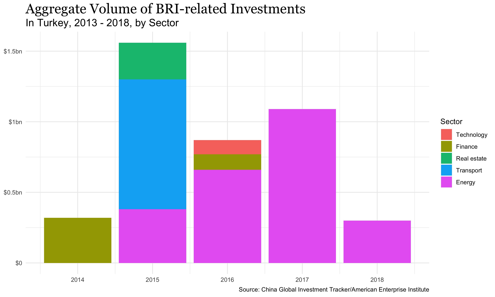

# Belt and Road Initiative (BRI) Investment in Middle East & North Africa

China's Belt and Road Initiative Map, Creative Commons Attribution-Share Alike 4.0, Made by User:Lommes on Wikipedia

This project investigates this question: In terms of both trade figures with China and official stances from states in those regions, how much impact does China’s practices in XUAR had on its diplomatic relations and the execution of BRI projects and investments with Muslim countries in the Middle East?

## Introduction
This project explores China's Belt Road Initiative (BRI) investments in Middle East &amp; North American countries across time. It's created for my final research paper for MODMEST 100: "Introduction to Modern Middle East" at Harvard College.

## Data

This project uses the data published by American Enterprise Institute's [China Global Investment Tracker](http://www.aei.org/china-global-investment-tracker/) dataset. With data until 2019, is the only public dataset on Chinese foreign investment at the time of this project.

The dataset is available for download from CGIT website. It is also included in this repository under the filename `China-Global-Investment-Tracker-2018.xlsx`.

## Visualization

The following are a selections of the visualization and analysis into the CGIT dataset. See `investment_stat.Rmd` for the source code that generated the graphics.

*Fig.1. Aggregate value of BRI investment and construction projects in selected MENA countries in billion USD. While the aggregate investment in Turkey remains lower than Iran and Saudi Arabia, the volume of investment has not shown drastic fluctuation across the years.*

## Acknowledgements

Derek Scissors. “Chinese Investment Dataset - China Global Investment Tracker.” AEI, 18 Jan. 2019, http://www.aei.org/china-global-investment-tracker/.
